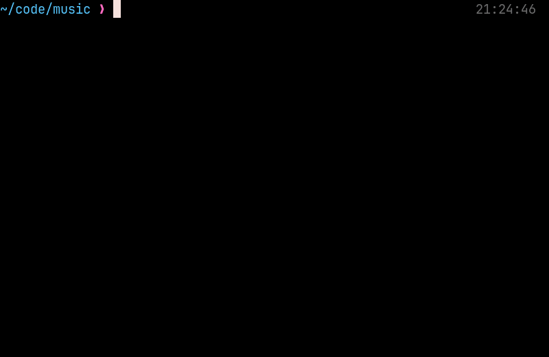

# Music CLI



-   [About](#about)
-   [Requirements](#requirements)
-   [Installation](#installation)
-   [Usage](#usage)
    -   [Querying & Playing Music](#querying---playing-music)
    -   [Live Results](#live-results)
    -   [Tags](#tags)
    -   [Installing music](#installing-music)
    -   [Auto Completion](#auto-completion)
    -   [Lastfm Scrobbling](#lastfm-scrobbling)
    -   [Lastfm Suggestions](#lastfm-suggestions)
    -   [Android](#android)
    -   [Configuration](#configuration)

## About

This is a simple command line tool to help with music-related tasks. This is
**not** a music player. It does not provide a TUI or GUI, and it uses VLC
internally. There are some command line tools available for music, such as ncmpcpp or cmus, but they do not allow you to launch music before you get into the TUI. Here are the main features:

1. Querying music quickly and playing it (on vlc)
2. Setting up a watch server to watch for playing music, and scrobbling it to [lastfm](https://www.last.fm/)
3. Tagging system for playlists and grouping of songs (stored in `$MUSIC_PATH/tags`)
4. Installing music (although very limited)

This program does not support piracy; you should have the rights to all your files.

## Requirements

-   VLC (if you plan on listening to music or scrobbling)
-   youtube-dl (if you plan on installing music)
-   playerctl (if you plan on scrobbling to lastfm with vlc)

## Installation

Install either from the release page or with go:

```
go install github.com/kitesi/music@latest
```

## Usage

This program works off a music directory which defaults to `$MUSIC_PATH` or `$HOME/Music`. Commands that consider a music path will have a `--music-path` option. I recommend a folder structure of:

```text
Music/
    Artist1/
        x.mp3
        y.m4a
    Category/
        z.mp3
```

But this is not necessary, as any file in your music path will be considered.
Files should follow some basic file naming rules: no new lines, no crazy
characters, etc.

### Querying & Playing Music

You can play music with the `play` command which will take in
any amount of positional arguments, these are called terms.

A term can have a "!" prefix, meaning it's a negation term, and anything that
matches that term fails. If no term is provided, the program will spawn VLC
with the music directory and the option `--recursive=expand`. Otherwise, a song
will have to match at least one of the terms and none of the negation terms. A
term can have required sections and one-of sections, specified with "#" and ","
respectively. When querying, the string that's tested is the lowercase full
path to the file minus your music path.

For example, `~/Music/Jaxson/Make Time For Me.m4a` would use
`jaxson/make time for me.m4a`.

Example of usage:

```shell
music play tonight monday#mornings care,bear,say make#you,me#believe \!joe
```

There are four terms here:

-   `tonight` (song has to have the word "tonight" somewhere in the path)
-   `monday#mornings` (song has to have both words "monday" and "mornings" (not necessarily next to each other))
-   `care,bear,say` (song has to have one or more of "care", "bear", "say")
-   `make#you,me#believe` (song has to have "make", either "you" or "me", and "believe")
-   `\!joe` (the song can't have the term, notice the escaping of "!")

When combining these terms, the string is split by `#` first, and then `,`.

#### Live Results


You can use `music play --live` to get a live query search of your songs.
I personally bind this command to a keybinding of `Ctrl+Alt+m`. I also have an
i3 keybinding to `Meta+m+x` so that it spawns a terminal with just the program.

```
bindsym $mod+m mode "music"

mode "music" {
    bindsym x exec alacritty --class floating -o window.padding.x=10 -o window.padding.y=10 -e music play --live; mode "default"
    # ...
}
```

### Tags

Tags are a way to group music. You can use it for playlists, genres or
whatever. Tags will be stored in `$MUSIC_PATH/tags/` as a m3u file.

You can view your tags with `music tags`. If you want to see the songs in a tag
use `music tags <tag>`.

If you want to delete a tag use `--delete` or `-d` or edit with `--edit` or `-e`.

The intended way to add songs to a tag is to query the songs with `music play`
and then using `--add-to-tag | -a <tag>` or `--set-to-tag | -s <tag>`. If you
need to query but don't want to actually play the songs you can add `--dry-run`.

### Installing music

`music install "https://www.youtube.com/watch?v=K4DyBUG242c" ncs` => download from youtube

The first positional argument is the link to download or a youtube video id. The
second is the child folder name of your music path to download to. The folder
name can be pretty loose in comparison to the real name. It's case-insensitive
and replaces spaces with dashes (-).

For example, if you had a folder named "Kite Hughes", you would use "kite-hughes".

### Auto Completion

This tool uses [cobra](https://github.com/spf13/cobra) which provides a
completion command you can use to generate completions.

It works fine, but it doesn't have reactive completion to a few things:
tags, music subdirectory install, format, and sort-type.

The cobra provided completion is also a bit more descriptive than I personally
like, which is why I use my own personal bash completion. It can be found in
`./completion.bash`

-   Note: I have `m` as an alias for `music` and `mx` as an alias for `music play`
-   Note: It's also more static/hard-coded, so a bit more error-prone/inaccurate.

### Lastfm Scrobbling

While VLC does have built in lastfm scrobbling, I could not get it to work
(edit: I actually got it to work, but it doesn't scrobble certain tracks and I
kinda already built this so whatever). You can run a watch server to watch for
playing songs every x seconds (defaulted to 10). It uses playerctl (MPRIS)
under the hood, so you will need to have that installed and be on linux (in the
future I could add vlc tcp support so that non-linux users could also use). It
also only checks for the VLC player so other media players or something like
youtube will not be logged. An alternative would be
[multi-scrobbler](https://github.com/FoxxMD/multi-scrobbler) which supports a
lot more sources, and has a lot more functionality overall.

Currently, the scrobble detection is kind of poor. It follows the approach of
minimizing false positives, so if you skip/seek around, it likely won't
scrobble. Also, if you play the same song over and over it won't scrobble more
than once (although this will be fixed in the future).

Lastly, it follows the [lastfm standards](https://www.last.fm/api/scrobbling):

1.  The track must be longer than 30 seconds.
2.  The track has been played for at least half its duration, or for 4 minutes (whichever occurs earlier.)

To get started first make an api account and application on [last.fm](https://www.last.fm/api/account/create). You then need to create a file (".lastfm-credentials") in your cache directory. Your cache directory is determined by Go below:

-   On Unix systems, it returns `$XDG_CACHE_HOME` as specified by https://specifications.freedesktop.org/basedir-spec/basedir-spec-latest.html if non-empty, else $HOME/.cache.
-   On Darwin, it returns `$HOME/Library/Caches`
-   On Windows, it returns `%LocalAppData%`
-   On Plan 9, it returns `$home/lib/cache`

In that file you should store your api_key and your api_secret:

```
api_key=xxxxx
api_secret=yyyy
```

Then just run the lastfm watch command, and it will automatically get the session_key:

```
music lastfm watch --interval 20 --debug
```

I personally have this command start on startup, and I redirect the output to `/tmp/music-lastfm.log`.

### Lastfm Suggestions

You can also get lastfm suggestions (on any OS, without authentication) with the suggest command.

```
music lastfm suggest username --limit 20
```

If you would like to automatically install the music add the `--install` flag which will install to `$MUSIC_PATH/Suggestions`.

### Android

If you would like to use the one of main functionalities of querying on android,
you can do so using Termux. You will likely have to install go first and then
follow the instructions in #installation.

After you have the music command installed, you want to download the wrapper script
in `./android-termux-mx`. This script calls the play command with the given query
in a dry run so that no program is called. It then sets the results to a new tag (query.m3u).

You should copy the file to a directory in your Termux's `$PATH`:

```bash
# assuming your $PATH is just one folder (like default)
curl https://raw.githubusercontent.com/kitesi/music/main/android-termux-mx > $PATH/mx
```

Once you have the script mx, you can now run it like you would `music play`:
`mx jaxson#tonight`. Now you can open up vlc and see that in your playlists tab
there should be a playlist called "query."

You are able to install vlc/cvlc/nvlc on termux, and in turn `music play` will
work like normal, but I would not suggest doing so because termux will be
hanging, and you won't have vlc in your notification tray.

### Configuration

The configuration file is located in `<$CONFIG_DIR>/go-music-kitesi/config.json`. An example can be found in [assets/default-config.json](assets/default-config.json). `<$CONFIG_DIR>` is specified as below:

-   On Unix systems, it returns $XDG_CONFIG_HOME as specified by https://specifications.freedesktop.org/basedir-spec/basedir-spec-latest.html if non-empty, else $HOME/.config.
-   On Darwin, it returns `$HOME/Library/Application Support`.
-   On Windows, it returns `%AppData%`.
-   On Plan 9, it returns `$home/lib`.
